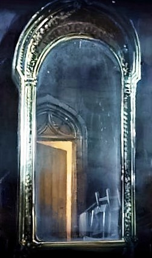

# Test of a steganography Img

Below the picture to decrypt.  

To decrypt it you can use the software OpenStego (requires Java), and simply put this file and indicate a folder for the results.

To obtain such a picture, with OpenStego pick two pictures that are large enough and follow the instructions. (put your secret in message and the cover in cover).

